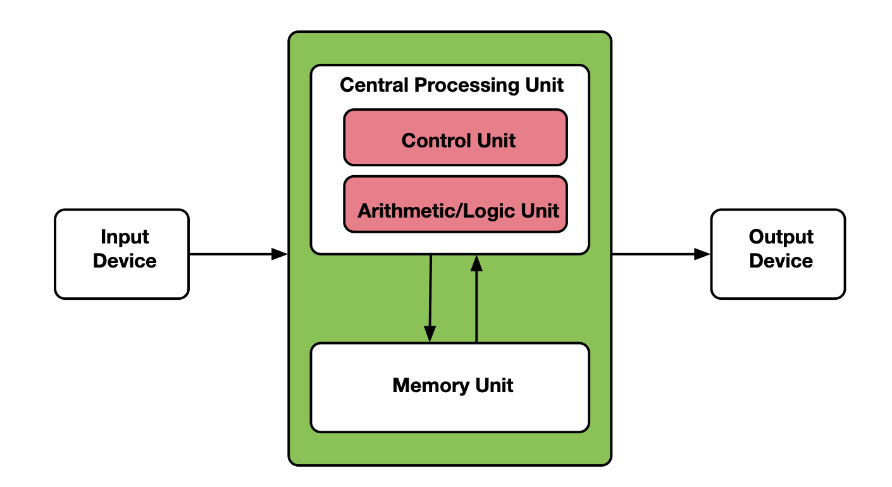
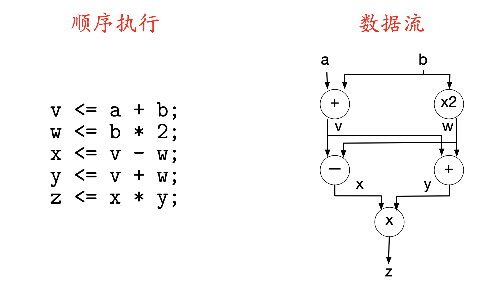
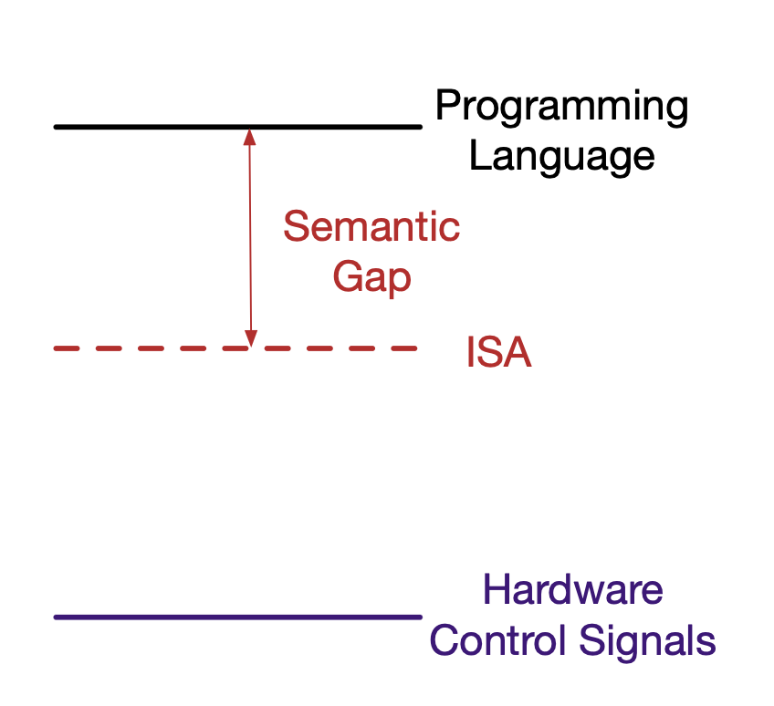
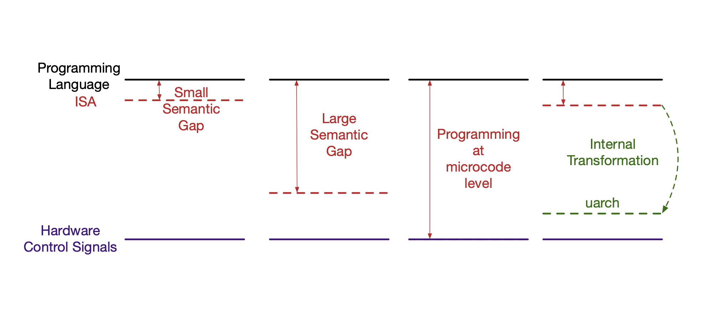

## 基本计算模型

### 计算机的基本组成部分

#### 计算机系统的三大部件
- 计算部分
    - 控制模块 control
    - 数据通路 datapath
- 存储（主存，memory）
    - 数据存储
    - 指令存储
- 数据传输
    - 内部模块的之间的数据传输
    - 外围设备的输入输出
### 冯诺伊曼模型/架构

- 程序存储
    - 指令是存储在线性地址空间的内存中的
    - 内存同时存放指令和数据
    - 特定内存单元中被解释为指令还是数据取决于控制信号
- 指令顺序执行模型
    - 每次执行一条指令，一条指令执行完之后执行下一条指令
    - 当前执行的指令由PC决定
    - 在无跳转时，PC是顺序递增的
### 数据流模型 Dataflow model
- 指令按照数据依赖关系构成执行图
    - 指令抽象为图中的节点
    - 给定每条指令所需数据的来源，数据依赖关系构成指令之间的边
- 没有PC的概念了
- 指令在输入的操作数准备好了就可以执行了
- 指令执行图中的节点（指令）可以同时执行（更好的并行性）
**指令按照数据处理或流动的顺序（data flow order）执行**
**冯诺伊曼模型中指令按照控制流顺序（control flow order）执行**

### 数据流编程模型
代码由指令执行图描述
### 计算模型的权衡
选择冯诺伊曼模型还是数据流模型
1. 对于程序员编程是否更容易
2. 编译器是否好设计
3. 哪一个性能更好
4. 硬件设计复杂度
### 数据流模型的实际应用
1. 现代乱序处理器
2. 常见并行软件的编程模型，如tensorflow
### 计算模型的并存与层次结构
绝大多数现代ISA使用冯诺伊曼架构
在microarchitecture上，大多数处理器不是冯诺伊曼架构
- 流水线结构
- 超标量
- 乱序执行
- 指令存储与数据存储分离
为什么可以这样？
- 层次结构将接口与具体实现分离
- 程序员所见的代码执行模型与实际执行模型可以不一样
## 指令集架构与微架构
ISA
microarchitecture
通常意义下architcuture包含 ISA与microarchitecture
### ISA中规定的内容
指令
内存
函数调用 中断/异常处理
访存权限， 特权指令
输入输出，IO指令或内存映射方式
功耗与热管理
多线程及多处理器支持
### microarchitecture中规定的内容
软件不可见的硬件实现
## 指令集设计权衡
### ISA设计基础：指令基本格式
指令格式（instruction format） 是软硬件接口的基本元素
关键信息：操作码（opcode）与操作码（oprands）
### 指令编码的设计权衡
单条指令的长度设计
- 固定长度
- 变长指令
### 指令编码权衡
- 统一指令编码（Uniform Decode）
    指令的给定的bit总是对应特定的含义
- 非统一指令编码（Non-uniform Decode）
    指令给定信息通过指示位来确定实际位置
### 操作执行模式权衡
基本指令执行的模式
零地址，单地址，双地址，三地址处理器：
- 0-address：堆栈机
- 1-address：累加器
- 2-address：双操作数处理器
- 3aaddress： 三操作数处理器
### 指令集权衡
#### 指令集复杂度权衡
- 支持的操作类型
    - 基础操作：算术逻辑运算，访存，跳转
    - 复杂操作： 快速傅立叶变换FFT， 字符串，链表插入
    - 例如：x86中的REP MOVES
- 支持的数据类型
    - 基础数据类型：整型，浮点型，字符型，BCD
    - 复杂数据类型：堆栈，队列，双向链表，字符串
### 语义鸿沟

ISA位置决定Semantic Gap的大小

### CISC与RISC的对比与演进
RISC的设计思路
- 访存会带来指令执行的暂停或阻塞（Memory Stalls）
    - 简化指令，将访存独立出来
    - 由编译器和硬件调整执行顺序，减少访存stall带来的性能损失
- 简化硬件->降低成本，提高主频
### 二者兼得？
- 语义转换（translation）
    - 硬件可以将一种ISA翻译成另一种ISA来改变语义权衡点
    - 对外虚拟的ISA->实际实现的ISA
### 可见状态与不可见状态
为何可以进行内部转换？
- 程序员可见的状态
    - 内存
    - 寄存器
    - PC
    指令集规定了执行指令后程序员可见的状态如何进行转换
- 程序员不可见的状态
    - 微架构状态
        - cache
        - 流水线寄存器
### 指令集设计权衡
- 存储组织
- 寄存器
    - 寄存器数量
        - 指令长度增加
        - 硬件复杂度增加
        - 减少访存次数，编译器寄存器分配更容易
    - 单个寄存器大小
    - 是否需要多种类型的寄存器
    - 为什么要在CPU中实现寄存器
        程序访存具有时间局部性
- Load/Store架构与register/memory架构
    - Load/Store架构：
    指令操作的源和目的操作数只能是寄存器
    - register/memory架构
    指令操作的源和目的操作数可以来源于内存
- 寻址模式
    - 优点：提高各类高级数据结构的访存效率
    - 缺点：硬件实现更加复杂，编译器更加复杂
- 输入输出实现
- 特权模式
- 异常/中断处理
- 虚拟内存
- 访存控制